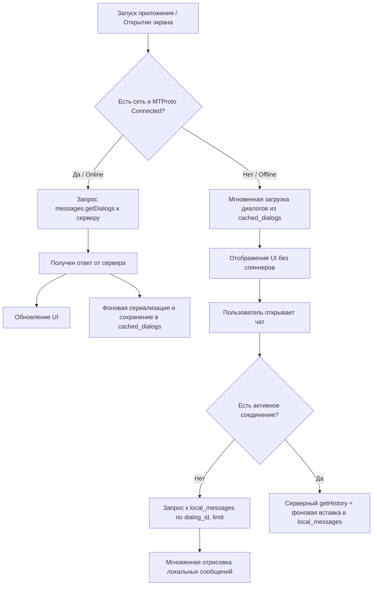
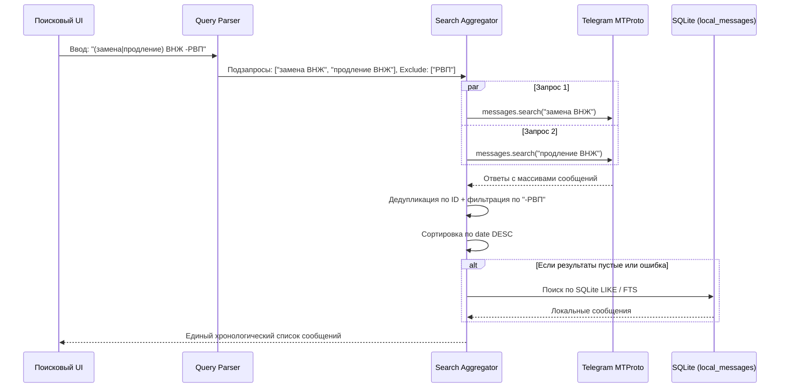
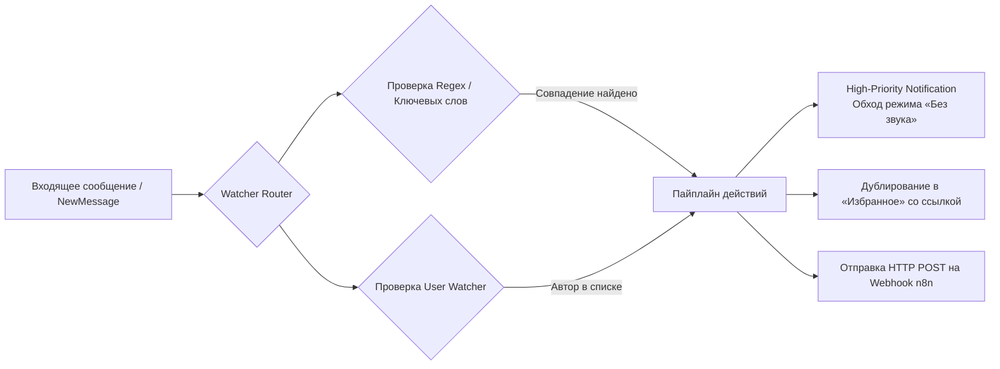
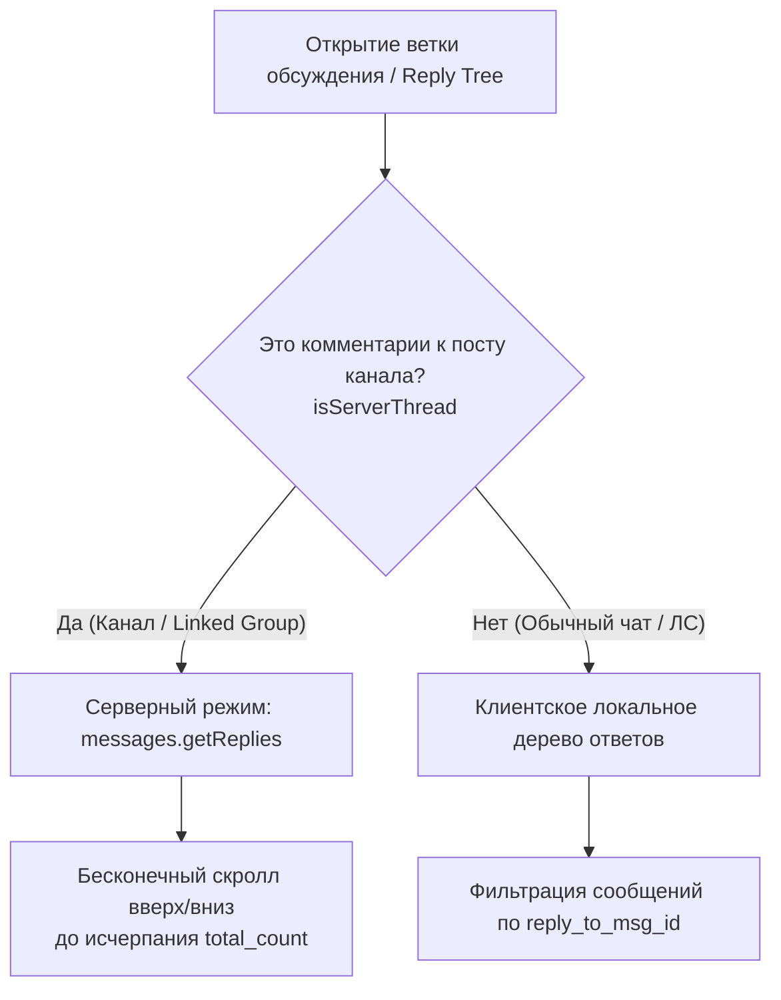
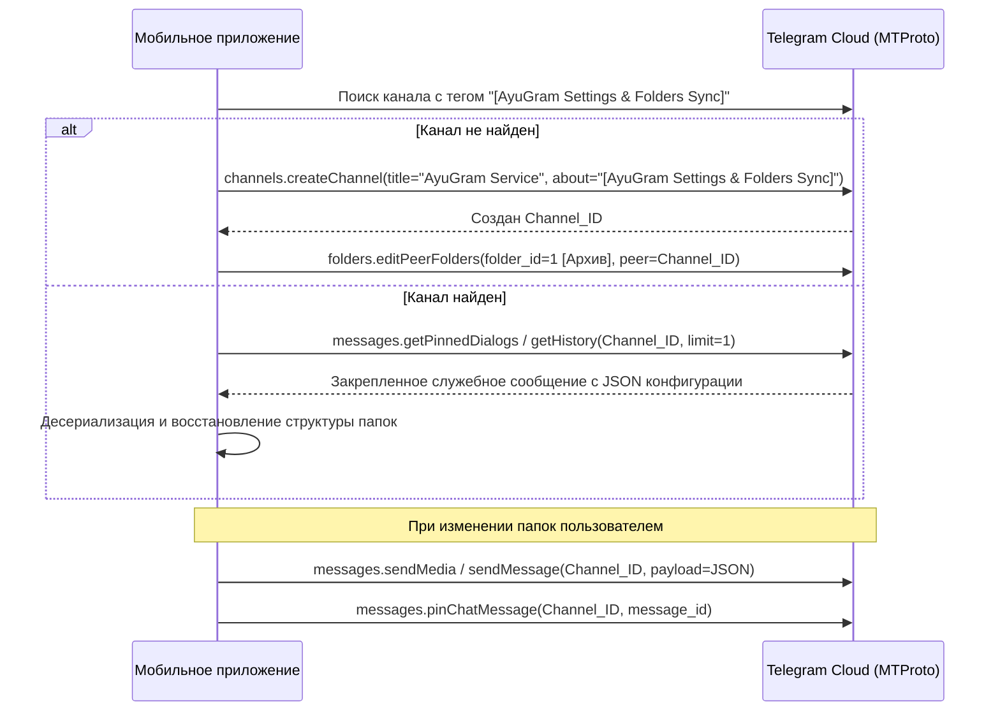

# Архитектурная спецификация доработок мобильного клиента (Android / AyuGram)

Настоящий документ содержит детальное описание архитектуры, структур данных, алгоритмов и граничных условий для реализации модификаций в мобильном клиенте **AyuGram для Android** (базирующемся на кодовой базе Telegram for Android / TDLib / Java & Kotlin).

Все описания даны в платформонезависимом виде (логика вызовов, структура локальной БД, конечные автоматы и перехват сетевых событий MTProto) для прямого переноса в мобильное приложение без привязки к синтаксису C++.

---

## 1. Подсистема: Полноценный оффлайн-режим (Offline-First Engine)

### 1.1. Проблема стандартного клиента
В официальном клиенте Telegram при отсутствии интернет-соединения или нестабильной сети клиент переходит в состояние ожидания (`Connecting...` / `Updating...`). При этом:
1. Список диалогов блокируется или очищается до завершения сетевой синхронизации.
2. Запросы на пагинацию истории сообщений (`messages.getHistory`) ставятся в сетевую очередь MTProto и зависают в ней до истечения сетевого таймаута, вместо того чтобы мгновенно отобразить уже имеющиеся локальные сообщения.
3. Поиск сообщений при отсутствии сети не возвращает результатов.

### 1.2. Архитектурное решение и модель данных

#### Схема таблиц локальной базы данных (SQLite / Room)
Для обеспечения оффлайн-доступа создаются две основные структуры хранения:

1. **Таблица сохранённых сообщений (`local_messages`)**:
   - `user_id` (INTEGER, 64-bit): Идентификатор текущего авторизованного аккаунта.
   - `dialog_id` (INTEGER, 64-bit): Идентификатор чата (пользователь, базовая группа, супергруппа/канал).
   - `topic_id` (INTEGER, 64-bit, default 0): Идентификатор темы форума (форумный тред). Для обычных чатов равен 0.
   - `message_id` (INTEGER, 64-bit): Идентификатор сообщения в рамках чата.
   - `from_id` (INTEGER, 64-bit): Идентификатор автора сообщения (пользователь или канал).
   - `date` (INTEGER, 32-bit): Unix-время создания сообщения.
   - `text` (TEXT): Текстовое содержимое сообщения (включая подписи к медиафайлам).
   - `raw_data` (BLOB): Сериализованный бинарный объект протокола (TL-объект `TLRPC.Message`).
   - *Первичный ключ*: `(user_id, dialog_id, message_id)`.
   - *Индексы*: 
     - `idx_local_messages_dialog_date` (`user_id`, `dialog_id`, `topic_id`, `date DESC`)
     - `idx_local_messages_from` (`user_id`, `dialog_id`, `from_id`, `date DESC`)
     - `idx_local_messages_text` (`user_id`, `dialog_id`, `text`)

2. **Таблица кэша списка диалогов (`cached_dialogs`)**:
   - `user_id` (INTEGER, 64-bit): Идентификатор аккаунта.
   - `folder_id` (INTEGER, 32-bit): Идентификатор папки (0 — общий список, 1 — архив, >= 1000 — кастомные локальные папки).
   - `raw_data` (BLOB): Сериализованный список диалогов и связанных сущностей (структура `TLRPC.messages_Dialogs` со списками диалогов, пользователей и чатов).
   - `updated_at` (INTEGER, 64-bit): Время последнего обновления.
   - *Первичный ключ*: `(user_id, folder_id)`.

### 1.3. Логика работы конвейера данных (Data Flow)



#### Правила сохранения (Interception Hooks)
- **Точка входа 1 (Входящие события / Updates)**: При получении `UpdateNewMessage`, `UpdateNewChannelMessage` или батча сообщений они немедленно асинхронно сериализуются и записываются/обновляются в таблицу `local_messages`.
- **Точка входа 2 (Просмотр истории)**: При скролле и получении сообщений с сервера в оперативную память (в объекте чата), каждое полученное сообщение транзитом сохраняется в `local_messages` (UPSERT: `INSERT OR REPLACE INTO local_messages ...`).
- **Точка входа 3 (Синхронизация папок)**: При успешном обновлении списка диалогов от сервера результат немедленно перезаписывает кэш в `cached_dialogs` для соответствующего `folder_id`.

#### Правила чтения при отсутствии сети (Fallback)
1. **Проверка статуса соединения**: Вводится проверка `isOffline()`. Условием оффлайна является:
   - Отсутствие интернет-соединения на уровне ОС (NetworkCapabilities / ConnectivityManager), ИЛИ
   - Состояние MTProto-клиента: `Connecting`, `Updating`, `WaitingForNetwork` с таймаутом более 1500 мс.
2. **Пагинация сообщений в оффлайне**:
   - При скролле вверх: `SELECT raw_data FROM local_messages WHERE user_id = :userId AND dialog_id = :dialogId AND topic_id = :topicId AND message_id < :offsetId ORDER BY date DESC LIMIT :limit`.
   - Десериализация TL-объектов сообщений и добавление в адаптер списка без сетевых вызовов и без ожидания ответа сокета.

---

## 2. Подсистема: Умный поиск и надежные локальные Fallbacks

### 2.1. Умный поиск с логическими операторами (Smart Multi-Search)

#### Синтаксис
Пользователь может вводить в строку поиска (как глобального, так и локального):
- Группировку по ИЛИ: `(слово1|слово2|слово3) общее_слово`
- Исключающие слова (минусование): `-исключение` (например: `(замена|продление) ВНЖ -РВП`)

#### Алгоритм обработки поисковой строки
1. **Парсинг операторов исключения**:
   - Из строки регулярным выражением извлекаются все токены, начинающиеся со знака минус: `(?:^|\s)-([^\s()|]+)`.
   - Найденные слова сохраняются в список `exclude_words = ["РВП", ...]`.
   - Из исходной строки поиска исключающие токены удаляются.
2. **Раскрытие скобок и декартово произведение**:
   - Если в строке присутствуют скобки `(...)`, парсер извлекает варианты, разделённые вертикальной чертой `|`.
   - Формируется декартово произведение условий. Например:
     `"(замена|продление) ВНЖ"` раскрывается в список подзапросов:
     - `запрос_1: "замена ВНЖ"`
     - `запрос_2: "продление ВНЖ"`
3. **Параллельные серверные запросы (Scatter-Gather)**:
   - Для каждого подзапроса формируется стандартный сетевой запрос `messages.search` (с сохранением фильтра чата/папки).
   - Запросы отправляются параллельно с индивидуальными идентификаторами запросов.
4. **Агрегация и склейка результатов (Aggregation & Deduplication)**:
   - Все полученные списки сообщений объединяются в один пул.
   - Выполняется дедупликация по уникальному ключу `(dialog_id, message_id)`.
   - Применяется фильтр исключений: если текст сообщения содержит хотя бы одно слово из `exclude_words` (без учёта регистра), сообщение отбрасывается.
   - Весь объединённый результат сортируется строго **по убыванию даты** (`date DESC`), что обеспечивает абсолютно нативный внешний вид выдачи.



---

### 2.2. Поиск по автору в чате и изоляция фильтров папок

#### Критический баг и его архитектурное исправление
1. **Изоляция проверки папки (`filterId`)**:
   - В логике фильтрации результатов поиска часто используется проверка принадлежности чата активной вкладке папки (`history.inChatList(currentFolderId)`).
   - **Строгое правило**: Данная проверка должна выполняться **только при глобальном поиске** (`globalSearch == true`).
   - Если поиск запущен внутри конкретного чата (`inChat == true`), фильтр активной папки **игнорируется полностью**. Сообщения не могут быть отброшены из-за того, что открыта вкладка другой папки.

2. **Обработка ошибки сервера `400 SEARCH_QUERY_EMPTY`**:
   - Когда пользователь выбирает фильтр по автору (`from_id`), но оставляет поле ввода текста пустым, официальный сервер Telegram на запросы `messages.search(q="", from_id=X)` в супергруппах часто возвращает ошибку `400 SEARCH_QUERY_EMPTY`.
   - **Логика перехвата**:
     ```text
     if (error == "SEARCH_QUERY_EMPTY" or messages.isEmpty()) and (fromPeer != null):
         // Не сбрасывать в состояние "Нет результатов"!
         executeLocalAuthorFallback(dialogId, fromPeer.id, query)
     ```

3. **Локальная выборка по автору из SQLite**:
   - Метод локального поиска поддерживает пустую строку запроса, если указан `from_id`:
     ```sql
     SELECT raw_data FROM local_messages
     WHERE user_id = :userId
       AND dialog_id = :dialogId
       AND (:fromId = 0 OR from_id = :fromId)
       AND (:hasQuery = false OR text LIKE :searchPattern ESCAPE '\')
     ORDER BY date DESC
     LIMIT :limit;
     ```

---

## 3. Подсистема: Мониторинг сообщений и авторов (Watchers Engine)

Модуль мониторинга работает в фоновом режиме на клиенте и анализирует весь поток входящих сообщений в реальном времени.

### 3.1. Архитектура Watchers Engine



### 3.2. Компоненты и модель данных

#### Конфигурация правила мониторинга (Watcher Rule)
Объект правила содержит:
- `id` (UUID / String): Уникальный идентификатор правила.
- `title` (String): Название правила.
- `regex_pattern` (String): Регулярное выражение для поиска (например: `(?i)(срочно|важно|аренда|внж)`).
- `included_dialog_ids` (List<Long>): Список ID чатов, где работает правило (если пуст — мониторятся все чаты).
- `excluded_dialog_ids` (List<Long>): Список ID чатов-исключений.
- `override_silent` (Boolean): Принудительный звуковой сигнал даже при беззвучном режиме чата/ОС.
- `forward_to_saved` (Boolean): Автоматическое дублирование сообщения в «Избранное» (Saved Messages).
- `webhook_url` (String, nullable): URL вебхука (интеграция с n8n / корпоративным сервером).

#### Персональный мониторинг авторов (User Watchers)
- `watched_user_ids` (Set<Long>): Список ID отслеживаемых пользователей.
- При поступлении сообщения от любого пользователя из списка в **любой** общей группе срабатывает событие обнаружения.

### 3.3. Пайплайн обработки действий (Action Pipeline)

1. **Обход беззвучного режима (Override Silent)**:
   - В Android создаётся выделенный канал уведомлений `NotificationChannel` с максимальной важностью `IMPORTANCE_HIGH` и кастомным звуковым потоком (использование аудиоатрибутов `USAGE_ALARM` или `USAGE_NOTIFICATION_RINGTONE`).
   - Уведомление генерируется с заголовком: `[Мониторинг: ИмяПравила] ИмяАвтора в ЧатНазвание` и текстом сообщения.

2. **Дублирование в «Избранное» (Saved Messages)**:
   - Клиент выполняет пересылку (`messages.forwardMessages`) сообщения в собственный диалог пользователя (Saved Messages / PeerSelf).
   - В текст служебной подписи или отдельным сообщением добавляется deep-link на исходный чат: `tg://resolve?domain=...&post=...` или `https://t.me/c/chat_id/msg_id`.

3. **HTTP Webhook (Интеграция с n8n / Automation)**:
   - Асинхронная отправка HTTP POST запроса без блокировки основного UI-потока.
   - **Формат JSON-пейлоада**:
     ```json
     {
       "event": "telegram_watcher_matched",
       "rule_title": "Мониторинг ключевых слов",
       "timestamp": 1726998000,
       "message": {
         "id": 123456,
         "date": 1726998000,
         "text": "Текст найденного сообщения",
         "chat": {
           "id": -1001234567890,
           "title": "Welcome to KZ (IT Hub)",
           "username": "welcome_kz"
         },
         "sender": {
           "id": 987654321,
           "username": "ivan_ivanov",
           "name": "Ivan Ivanov"
         },
         "link": "https://t.me/c/1234567890/123456"
       }
     }
     ```

4. **Быстрый поиск постов пользователя по всем чатам**:
   - В профиле каждого пользователя добавляется действие: «Все сообщения пользователя».
   - При нажатии открывается экран глобального поиска с фильтром по `from_id` без ограничения конкретным чатом, который выполняет поиск по всем общим группам через локальную базу и серверные запросы.

---

## 4. Подсистема: Ветки комментариев и обсуждений (Discussion Threads)

### 4.1. Проблема
В мобильных и десктопных клиентах при переходе в комментарии к посту канала из связанной супергруппы (discussion group) клиент иногда ошибочно инициализировал локальное дерево ответов (`reply_to_msg_id`), ограничивая пользователя первыми 10–16 закэшированными сообщениями и блокируя подгрузку остальных сотен комментариев.

### 4.2. Архитектурное разделение

Вводится чёткая классификация типа треда:



### 4.3. Алгоритм проверки `isServerThread(chat, rootMessageId)`
```text
function isServerThread(dialog, message):
    if dialog is Channel and dialog.isBroadcast:
        return true
    if dialog is Supergroup and dialog.linkedChatId != 0:
        // Если сообщение является постом, пересланным из привязанного канала:
        if message.forwardFromChatId == dialog.linkedChatId:
            return true
        // Если у сообщения выставлен флаг обсуждения:
        if message.replies != null and message.replies.isComments:
            return true
    return false
```

- **При `isServerThread == true`**:
  - Клиент **всегда** вызывает MTProto API `messages.getReplies(peer, msg_id, offset_id, offset_date, add_offset, limit, max_id, min_id)`.
  - При прокрутке вверх и вниз вызываются `loadBefore` и `loadAfter` с изменением `offset_id`.
  - Количество элементов списка привязывается к счётчику `replies.replies` (серверный счётчик комментариев, например, 217 комментариев).

---

## 5. Подсистема: Синхронизация папок через сервисный канал

### 5.1. Задача
Обеспечить надёжное сохранение пользовательских локальных папок (созданных сверх лимитов Telegram Premium или с локальными правилами фильтрации) между сессиями и переустановками приложения, используя облако самого пользователя Telegram без сторонних серверов.

### 5.2. Архитектура сервисного канала



### 5.3. Спецификация формата данных синхронизации (JSON Payload)
Конфигурация папок сохраняется в виде зашифрованного/открытого JSON-файла или текстового документа в закреплённом сообщении сервисного канала:

```json
{
  "version": 1,
  "app": "AyuGram",
  "updated_at": 1726998000,
  "folders": [
    {
      "id": 1001,
      "title": "КЗ",
      "emoticon": "🇰🇿",
      "flags": {
        "contacts": false,
        "non_contacts": false,
        "groups": true,
        "channels": true,
        "bots": false,
        "exclude_muted": false,
        "exclude_read": false,
        "exclude_archived": true
      },
      "included_peers": [-1001234567890, -1009876543210],
      "excluded_peers": []
    }
  ]
}
```

---

## 6. Подсистема: Блокировка Stories и очистка коммерческих элементов

### 6.1. Глубокая блокировка трафика Stories (Data & Traffic Saver)

В стандартном клиенте Telegram истории (Stories) генерируют существенный сетевой трафик и расходуют заряд аккумулятора за счёт фоновой предзагрузки медиа.

#### Точки перехвата в сетевом слое (`ConnectionsManager`):
1. **Блокировка API-запросов**:
   - При попытке клиента сформировать и отправить следующие MTProto-запросы, вызовы немедленно прерываются с возвратом пустого успешного ответа:
     - `stories.getAllStories` -> возврат `TLRPC.TL_stories_allStories` с пустым списком `stories = []`.
     - `stories.getPeerStories` -> возврат пустого контейнера историй.
     - `stories.getStoriesArchive` -> возврат пустого контейнера.
2. **Отключение фоновой предзагрузки**:
   - Запрет вызовов методов предзагрузки медиа историй (`preloadUserStories`, `downloadStories`).
3. **Сокрытие из UI**:
   - Полное скрытие `StoriesTabsView` (горизонтальной панели с кружками историй над списком чатов).
   - Отключение анимированных цветных градиентных ободков историй на аватарах пользователей в списках чатов и в профилях.

### 6.2. Удаление коммерческих элементов интерфейса (De-bloat)

Для устранения визуального шума из интерфейса вырезаются следующие элементы:
1. **Настройки аккаунта**:
   - Удаление секции «Звёзды Telegram» (`Telegram Stars` / `credits`).
   - Удаление секции «Кошелёк / TON / Валюта» (`currency`).
2. **Профили пользователей и меню чатов**:
   - Скрытие кнопок «Отправить подарок» (`send-gift`).
   - Скрытие рекламных бейджей подписок и промо-блоков Telegram Premium в разделах настроек.

---

## 7. Сводная таблица компонентов для разработчиков Android

| Функция / Модуль | Компоненты Telegram-Android (где править) | Ключевые действия |
| :--- | :--- | :--- |
| **Оффлайн-кэш диалогов** | `MessagesController.java`, `MessagesStorage.java` | Добавление таблицы `cached_dialogs`; мгновенная отдача кэша при старте без сети. |
| **Оффлайн-история сообщений** | `MessagesStorage.java`, `ChatActivity.java` | Добавление таблицы `local_messages`; перенаправление `getHistory` в SQLite при `isOffline()`. |
| **Умный поиск (ИЛИ, минусы)** | `SearchEngine.java`, `DialogsSearchAdapter.java` | Парсинг скобок и декартово произведение подзапросов; агрегация и сортировка по дате. |
| **Поиск по автору в чате** | `DialogsSearchAdapter.java`, `MessagesStorage.java` | Изоляция фильтра папки (`filterId`) только для глобального поиска; локальный fallback при `SEARCH_QUERY_EMPTY`. |
| **Watchers Engine** | `NotificationsController.java`, `KeepAliveService.java` | Перехват `UpdateNewMessage`; регулярные выражения; high-priority push; отправка webhook. |
| **Серверные треды каналов** | `ChatActivity.java`, `MessageObject.java` | Внедрение метода `isServerThread`; использование `messages.getReplies` с серверной пагинацией. |
| **Синхронизация папок** | `MessagesController.java` | Автоматическое создание архивного сервисного канала; сохранение JSON конфигурации. |
| **Блокировка Stories** | `ConnectionsManager.java`, `DialogsActivity.java` | Подавление сетевых запросов историй; сокрытие верхней панели историй. |

---

*Спецификация подготовлена для команды разработки AyuGram Android.*
